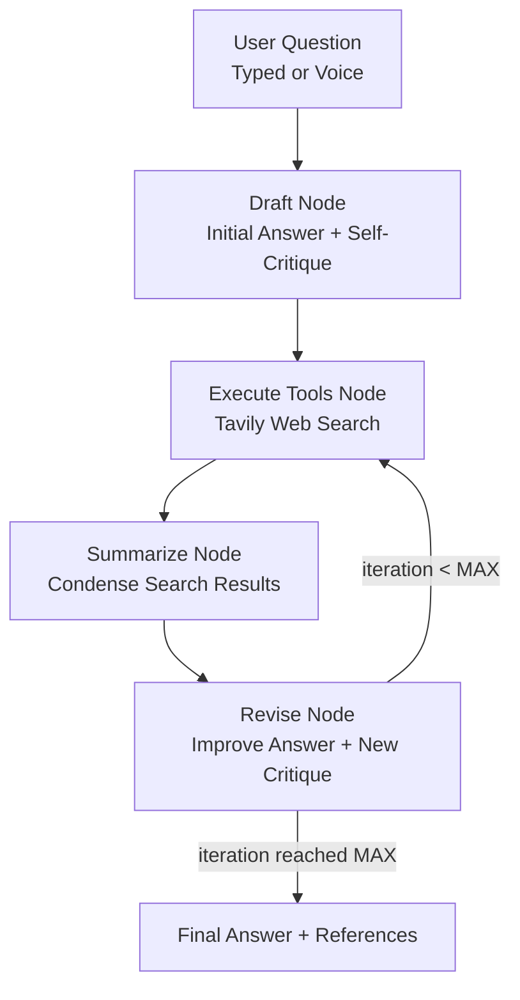

# 🧠 Reflexion Research Agent

A self-critiquing research agent built with **LangGraph** and **LangChain**, wrapped in an interactive **Streamlit** UI. Instead of answering a question once, the agent drafts an answer, critiques itself, searches the web to fill its own gaps, summarizes the search results, and revises the answer before returning a final, cited response.

The project also supports **voice input**, allowing users to speak their question instead of typing it. The recorded speech is converted into text using **Faster Whisper** and returned to the same ChatGPT-style input workflow, where the user can review or edit the transcription before submitting it.

🔗 **Live Demo:** [reflexagent.streamlit.app](https://reflexagent.streamlit.app/)  
📦 **GitHub Repository:** [dev-ghosh/ReflexionAgent](https://github.com/dev-ghosh/ReflexionAgent)

---

## ✨ What It Actually Does

You ask a question → the agent creates a first-pass answer → it critiques itself by identifying what is missing and what is unnecessary → it generates follow-up web searches → Tavily retrieves relevant information → the results are summarized → the agent revises its answer with numbered citations.

You can provide the question in two ways:

- ⌨️ **Type** directly into the input bar
- 🎤 **Speak** using the microphone button in the same input bar

For voice input, **Faster Whisper** automatically converts the recording into text. The transcription is returned to the same input workflow, allowing the user to check or edit it before submitting the question.

The user sees the clean final **answer** and **references**, with an optional expandable section showing what the agent identified and improved during its Reflexion loop.

---

## 🎤 Voice Assistant

The project includes a voice-enabled input experience inspired by modern AI assistants such as ChatGPT, Gemini, and Claude.

### Voice Input Flow


### How It Works

The voice pipeline uses:

- **Streamlit `st.chat_input()`** with audio support for the single text/voice composer
- **Faster Whisper** for speech-to-text transcription
- **Temporary WAV files** to pass recorded audio to Faster Whisper
- The resulting transcription is returned to the same input workflow
- The user can verify or edit the transcription before submitting it

### Why Voice Input Benefits the User

- **Faster interaction** — users can speak naturally instead of typing long questions.
- **Better for complex questions** — users can explain research topics conversationally.
- **More natural experience** — the interface feels closer to modern AI assistants.
- **Review before execution** — the transcription can be checked and edited before it reaches the agent.
- **Accessibility** — voice input can help users who find typing inconvenient.
- **Same research workflow** — typed and spoken questions enter the same Reflexion pipeline.

> **Important:** Faster Whisper is used for speech-to-text. It does not replace the Groq LLM. Groq remains responsible for the agent's reasoning, drafting, critique, and revision.

---

## 🔄 How It Works — Reflexion Pattern

This implements the **Reflexion** technique: the LLM acts as its own reviewer. Each cycle produces a `missing` and `superfluous` self-critique, which drives the next revision — a lightweight form of self-improvement without fine-tuning.



### Nodes

| Node | File | Responsibility |
|---|---|---|
| `draft` | `chains.py` → `first_responder` | Generates the first answer, a self-critique (`missing`/`superfluous`), and 1–3 follow-up search queries |
| `execute_tools` | `tool_executor.py` | Runs the generated search queries via Tavily |
| `summarize` | `summarizer.py` | Condenses raw search results into a short summary to keep token usage down |
| `revise` | `chains.py` → `revisor` | Rewrites the answer using the search summary, adds numbered references, and re-critiques |
| `voice input` | `speech.py` | Converts recorded speech into text using Faster Whisper |

The loop (`execute_tools → summarize → revise`) repeats until `MAX_ITERATIONS` is hit, controlled by `event_loop()` in `main_st.py`.

---

## 🧰 Tech Stack

- **LangGraph** — orchestrates the draft → search → summarize → revise loop as a stateful graph
- **LangChain** — prompt templates, tool binding, and output parsing
- **Groq (Llama 3.3 70B Versatile)** — LLM for drafting, critiquing, and revising
- **Tavily Search API** — web search tool for grounding revisions in real information
- **Faster Whisper** — converts spoken questions into text
- **Streamlit** — interactive web UI and single text/voice input composer
- **Pydantic** — structured output schemas (`AnswerQuestion`, `ReviseAnswer`, `Reflection`) so tool calls remain typed and parseable

---

## 📁 Project Structure

```text
ReflexionAgent/
├── app_voice.py          # Streamlit UI and text/voice input
├── speech.py             # Faster Whisper speech-to-text functionality
├── main_st.py            # Graph definition: build_graph(), run_agent(), extract_result()
├── chains.py             # LLM setup + first_responder & revisor prompt chains
├── tool_executor.py      # Executes Tavily searches based on LLM-generated queries
├── summarizer.py         # Condenses raw search results before revision
├── schemas.py            # Pydantic schemas: AnswerQuestion, ReviseAnswer, Reflection
├── state.py              # GraphState (LangGraph shared state definition)
├── main_rex.py           # Standalone Reflexion agent runner
├── tool_tester.py        # Standalone script to sanity-check tool-calling with Groq
├── requirements.txt
└── .gitignore
```

---

## 🧠 Graph State

Defined in `state.py`, shared across all nodes:

| Field | Type | Purpose |
|---|---|---|
| `messages` | `list` (append-only) | Full conversation / tool-call history |
| `search_results` | `str` | Raw Tavily search output |
| `search_summary` | `str` | Condensed summary fed into the revisor |
| `iteration` | `int` | Tracks revision count against `MAX_ITERATIONS` |

---

## ⚙️ Setup

### 1. Clone the repository

```bash
git clone https://github.com/dev-ghosh/ReflexionAgent.git
cd ReflexionAgent
```

### 2. Create and activate a virtual environment

Python **3.11** is recommended for this project.

Windows PowerShell:

```powershell
py -3.11 -m venv .venv
.venv\Scripts\Activate.ps1
```

### 3. Install dependencies

```bash
pip install -r requirements.txt
```

Make sure `requirements.txt` includes:

```text
faster-whisper
```

along with the project's existing dependencies.

### 4. Add API keys

For local development, create a `.env.rex` file in the project root:

```env
GROQ_API_KEY=your-groq-key
TAVILY_API_KEY=your-tavily-key
```

Never commit `.env.rex` to GitHub. Make sure it is included in `.gitignore`.

### 5. Run locally

The Streamlit UI is `app_voice.py`:

```bash
streamlit run app_voice.py
```

---

## ☁️ Deployment — Streamlit Community Cloud

The live application is available here:

**[https://reflexagent.streamlit.app/](https://reflexagent.streamlit.app/)**

To deploy your own copy:

1. Push the repository to GitHub, excluding `.env.rex`.
2. Open [Streamlit Community Cloud](https://share.streamlit.io/).
3. Select **New app**.
4. Select the `dev-ghosh/ReflexionAgent` repository.
5. Select the branch containing the project.
6. Set the main file to:

```text
app_voice.py
```

7. Under **Settings → Secrets**, add:

```toml
GROQ_API_KEY = "your-groq-key"
TAVILY_API_KEY = "your-tavily-key"
```

8. Deploy the application.

> **Voice deployment note:** the deployment environment needs to install `faster-whisper` from `requirements.txt` for speech-to-text to work.

---

## 🖥️ UI Features

### Single Text + Voice Composer

The main input is designed as a single AI-assistant-style composer:

```text
┌──────────────────────────────────────────────────────┐
│ Ask anything...                               🎤  ➤ │
└──────────────────────────────────────────────────────┘
```

Users can:

1. Type a question.
2. Click the microphone and speak a question.
3. Let Faster Whisper convert the speech into text.
4. Review or edit the resulting question.
5. Submit it to the Reflexion Agent.

### Research Output

- Clean **final answer**
- **Numbered references**
- Expandable **Reflexion critique history**
- Visibility into what the agent identified as **missing**
- Visibility into what the agent identified as **superfluous**

---

## 🔐 Environment Variables

| Variable | Purpose |
|---|---|
| `GROQ_API_KEY` | Authenticates requests to Groq |
| `TAVILY_API_KEY` | Authenticates Tavily web searches |

Do not expose API keys in source code or commit them to GitHub.

---

## 🎯 Why This Project Is Useful

This project demonstrates more than a basic LLM chatbot.

It combines:

- Agentic workflows
- LangGraph state management
- Tool calling
- Web search
- Self-critique
- Iterative answer refinement
- Structured outputs with Pydantic
- Speech-to-text
- A user-friendly Streamlit interface

The voice feature demonstrates how a traditional text-based AI research workflow can be extended into a more natural interaction without changing the underlying reasoning pipeline.

---

## 🚀 Possible Improvements

- Add streaming responses
- Add conversation history and persistent memory
- Add authentication
- Add retry/error handling around Tavily and Groq API timeouts
- Pin dependency versions for reproducible builds
- Add a screenshot/GIF of the UI
- Add a `LICENSE` file
- Add configurable Whisper models (`tiny`, `base`, `small`, etc.)
- Add language selection for multilingual speech recognition
- Add audio recording history
- Add source-quality/ranking logic
- Add observability/tracing with LangSmith
